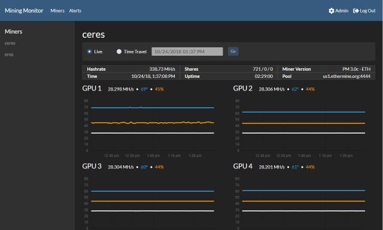

# Mining Monitor

Mining Monitor is a free and open-source monitoring tool for ethereum mining rigs.

### Features

* Real time monitoring
* Mobile-friendly web UI
* Custom Alerts
* Alert actions
* Multiple installation modes
  * Docker 
  * Windows Service

## Installation

### Windows
Mining monitor can be installed on windows as a windows service. Download the latest installer msi file from the [releases](https://github.com/lennykean/MiningMonitor/releases) page.

The Mining Monitor web UI can be accessed on port 8506 at the url http://localhost:8506

### Linux (Docker)
Mining Monitor is available as a docker container on dockerhub 

#### Port
The Mining Monitor web UI runs on port 80 inside the container. To access the web UI, the port must be exposed from the host machine. See the example below.

#### Data
Data is stored in /app/data within the container. To persist data, a volume must be mounted to the host machine, see the example below.

#### Docker Command
`docker run -d -p 80:80 -v /data:/app/data lennykean/miningmonitor:latest`

## Monitoring

The monitoring page will auto-update with the last hour of data, including a graph of GPU hashrate, temperature, and fanspeed. There is also a time-travel option to see the same data at a specified point in time.

## Alerting

Alerts can be configured to trigger when metrics fall outside of a specified range, or if a metric falls outside of a specified range for longer than a specified amount of time. Metrics that can be alerted on include rig hashrate, rig connectivity, GPU hashrate, GPU temperature, and GPU fanspeed. 

### Actions

Alert actions can be configured to take an action when an alert is triggered. The actions that can be taken include disabling the affected GPU, or all GPUS, resetting the mining rig, or calling a webhook. 

## Remote Data Collection

Remote data collection allows you to have a single instance that acts as a central repository. This is useful if you keep your miners on a private network, but want the data exposed in a publicly accessable location.

## Configuration

### Mongo Database

By default, Mining Monitor uses an in-process database called [LiteDB](http://www.litedb.org/). MongoDB can be used be used instead by setting the environement variable `use_mongo` to `true`. The mongo connection string must also be set by using the environment variable `ConnectionStrings__miningmonitor` 

### Remote Data Collection

To configure an instance as a data collector, check the data collector box in the admin panel and provide the remote server URL. On the remote server, the data collector must be marked as approved from the admin panel's data collector list.

### Security

To secure your server with a username and password, enable authentication from the admin panel. At least one user must be created before authentication can be enabled. 

*Note:* If you make your server is available publicly, it is recommended that you put it behind a reverse proxy with https. Remember, usernames and passwords can be read in transit on insecure connections. 
